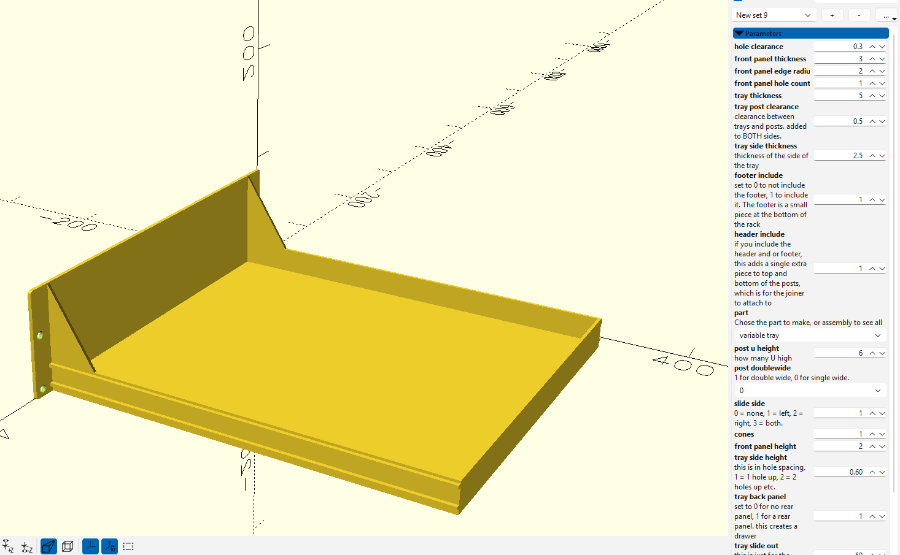
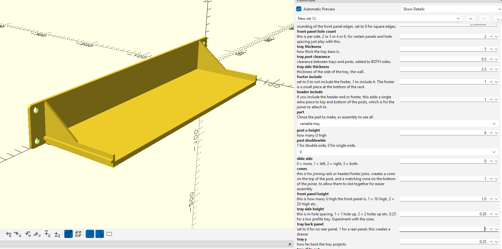
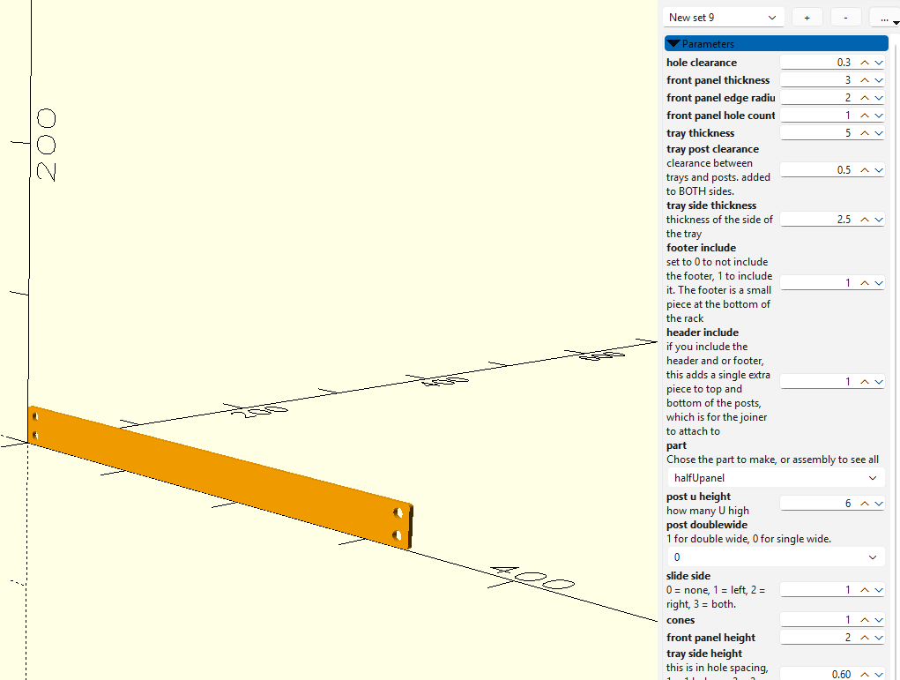

Most of this readme was wrote by copilot, because I am a forklift operator, not a novelist. But I did write most of the code and the spec.

If you like the design, you're welcome to buy me a coffee:

# 330mm / 13-Inch Rack System (OpenSCAD)

A parametric, 3D-printable rack system designed for larger-format printers such as the Creality K2 Plus, Prusa XL, etc. The rack is 330mm wide — measured from the left edge of the left post to the right edge of the right post (single-post configuration).

---

## Design Goals

- **Rear-slide tray support** — trays slide into a slot in the rear post rather than bolting front and rear. This means trays can be removed without dismantling the rack.
- **Fully parametric** — all dimensions, hole counts, heights and clearances are driven by variables. Use the OpenSCAD Customizer to configure parts without editing code.
- **Modular** — mix single/double-wide posts, variable-height trays and panels, and optional joiners.

---

## Parts

### Posts

Posts are the vertical rails of the rack. They are generated in configurable U heights and can be single or double wide. A slide channel can be added to the left side, right side, both sides, or neither. 

### Trays

Trays are available in fixed sizes (1U, 2U) or a fully variable size. The variable tray accepts a `tray_back_panel` flag to add a rear panel, turning it into a drawer. Trays slide into the post's rear slot for easy removal. Trays also don't need to be full length, defining 0.25 will make a quarter depth tray (y axis)

### Panels (Blanking Panels)

Flat front panels for blanking unused rack slots. Available in ½U, 1U, 2U, and variable sizes.

### Footer / Header

Optional pieces added to the top and bottom of posts. They provide an attachment point for the joiners.

### Joiners (Base / Top)

Optional horizontal joiners that connect the front posts to the rear posts via the footer/header. 
You can have more than just 4 posts. The joiners can have 2+ supports, by increasing the number and printing more posts, you can have greater supports

---

## Custom Trays

The file `330mm rack custom tray 01.scad` provides an example of a custom tray — including IO cutouts (e.g. Raspberry Pi 5 USB/Ethernet ports), standoffs with heat-set inserts, and embossed logos. Use this as a starting point for your own designs.

---

## Usage

1. Open `330mm rack parts.scad` in OpenSCAD (use the nightlys, the offical releases are mega old).
2. Open the **Customizer** panel (Window → Customizer).
3. Select the part you want from the `part` dropdown:
   - `assembly` — preview all parts together
   - `post` — a single post
   - `base joiner` / `top joiner` — horizontal joiners
   - `1U tray` / `2U tray` / `variable tray` — trays
   - `halfUpanel` / `1U panel` / `2U panel` / `variable panel` — blanking panels
4. Adjust the parameters to suit your needs.
5. Render (F6) and export to STL or 3MF

### Key Parameters

| Parameter | Description |
|---|---|
| `post_u_height` | Height of the post in U units |
| `post_doublewide` | `0` = single wide, `1` = double wide |
| `slide_side` | `0` none, `1` left, `2` right, `3` both |
| `front_panel_height` | Panel/tray height in U (can be fractional, e.g. `1.5`) |
| `front_panel_hole_count` | Mounting holes per side (2, 3, 4, or 6) |
| `tray_side_height` | Tray side wall height in hole spacings |
| `tray_back_panel` | `0` = open tray, `1` = drawer with rear panel |
| `footer_include` / `header_include` | Include footer/header attachment pieces |

### Hardware

The design is based on **M6 screws** with **M6 hex nuts** (10mm across-flats, 5mm thick). Adjust `hole_clearance`, `hole_d`, `nut_diameter`, and `nut_thickness` in `330mm rack defines.scad` if you want to use different fasteners.

---

## File Structure

| File | Purpose |
|---|---|
| `330mm rack parts.scad` | Main entry point — select and configure parts here |
| `330mm rack defines.scad` | All default dimensions and constants |
| `330mm rack posts.scad` | Post geometry |
| `330mm rack tray.scad` | Tray and panel geometry |
| `330mm rack custom tray 01.scad` | Example custom tray (Raspberry Pi 5) |
| `330mm rack *.3mf` | Pre-sliced print files for reference |

---

## Requirements

- [OpenSCAD](https://openscad.org/) the releases are ancient, use the nightlies instead.
- A printer with at least 330mm on one axis (e.g. Creality K2 Plus, Prusa XL)

---

## License

This project is licensed under the **GNU General Public License v3.0 (GPL-3.0)**.  
See [https://www.gnu.org/licenses/gpl-3.0.html](https://www.gnu.org/licenses/gpl-3.0.html) for the full licence text.

&copy; 2026 Adam Mead
