# Variable width Rack design.

No longer are you stuck with 10" rack or a 19" rack you can't print parts for! What's more, you can actually have supported trays :)

So, what is this actually?
Simply put, I wanted a bigger rack that I could print on my Creality K2plus (350x350x350 build volume) and I wanted it to be 100% in OpenSCAD. Because that's the only software I can use. Fusion 360 is good, but eats cpu, doesn't work on Linux, and worst of all, they changed the licence and features available for hobbyists.
What about FreeCAD? Yeah, FreeCAD is getting good now, but I just didn't want to learn it, because that would require starting out with the spec nailed down before even creating a design. It wasn't.

One of the biggest reasons for creating it was also anger. I printed the parts for a 10" mini rack because I was prepared to make do. But the design was such that to remove a tray, you need to dismantle the whole thing, because of the way the trays are secured at the rear.

There is a picture of the mini-rack that made me angry at the bottom of this readme.

Anyway, if you like the design, you're welcome to buy me a coffee:

A quick overview

Below is a screenshot of OpenSCAD with a assembly view. This is just to show an example of some of what is possible. Everything is customisable.

I've numbered some arrows so you can see:

1. is showing top header, this is an extra hole added to the post for joining to 2. These  are not required if you don't want stability.
2. is the top join, this joins the posts together at the top. Note: you can have 4 OR MORE posts. I have 6 in this example and how I use it. They can optionally (recommended) have the support cones. This is so the posts can lock in place if they also have cones.
3. A half U panel. Technically not half-U, but that's what I called it. This is used to span across the posts and secure the top and bottom joins.
4. The bottom join. Just like the top.
5. Here is where you put post joins. These are a little square section that joins the inner posts to the top/bottom joins. Otherwise they'd be floating.
6. A side panel. In my case I made a honeycome panel and added a raspberry pi logo.

Note: For mine I used 6 posts (great for half depth trays), 4 face forward, rear 2 face backwards. Consider this when creating posts for which side you want the side-slides on.

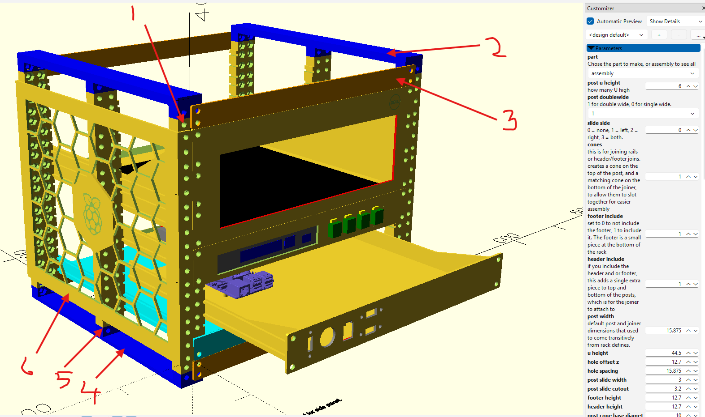

Rear view

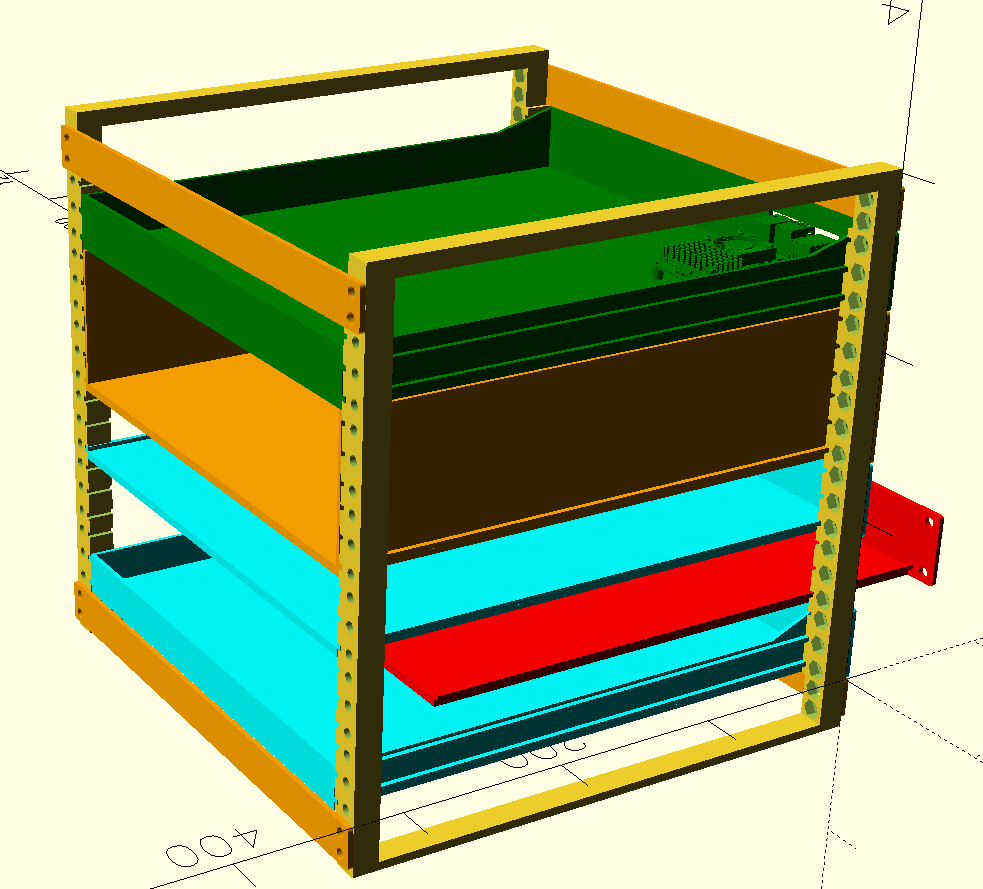

8 legged freak

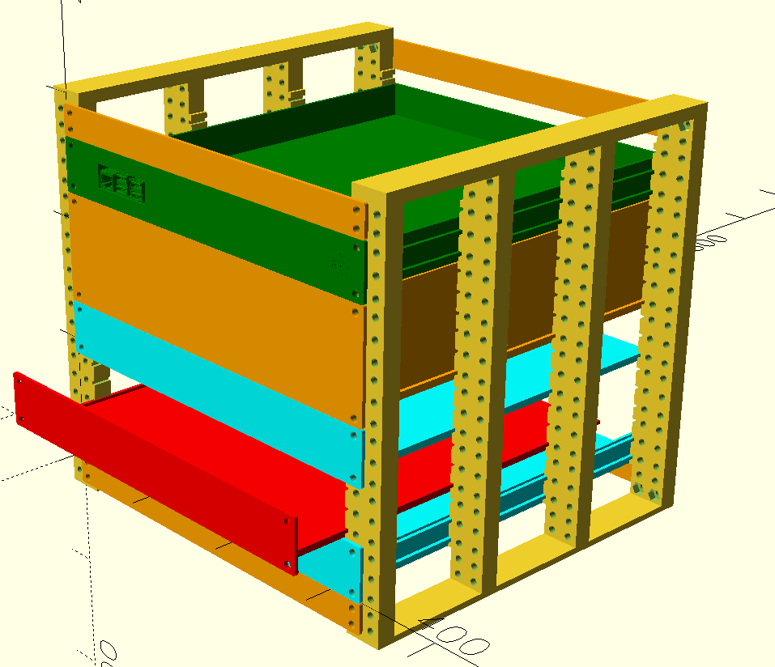

How about a part complete rack, as in.. mine. I do have a tray for the Dell, but haven't printed it yet, so the Dell is just thrown in there. It is not a good computer, it is old but it was free.

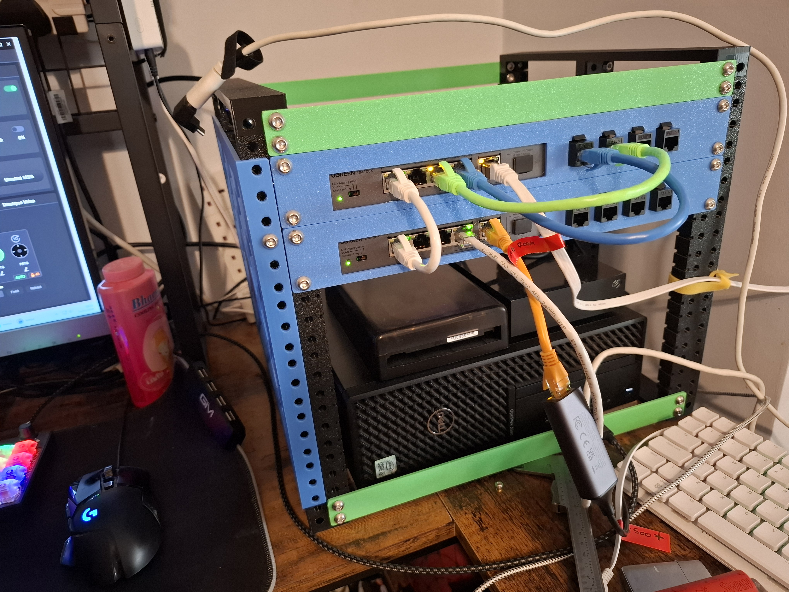

Now the side panel. You don't have to have honeycomb, you can have a few different designs, plus size of shapes, image/logo is also optional. I have a RPi logo because I have a bunch of them. They'll end up in the rack in due course.

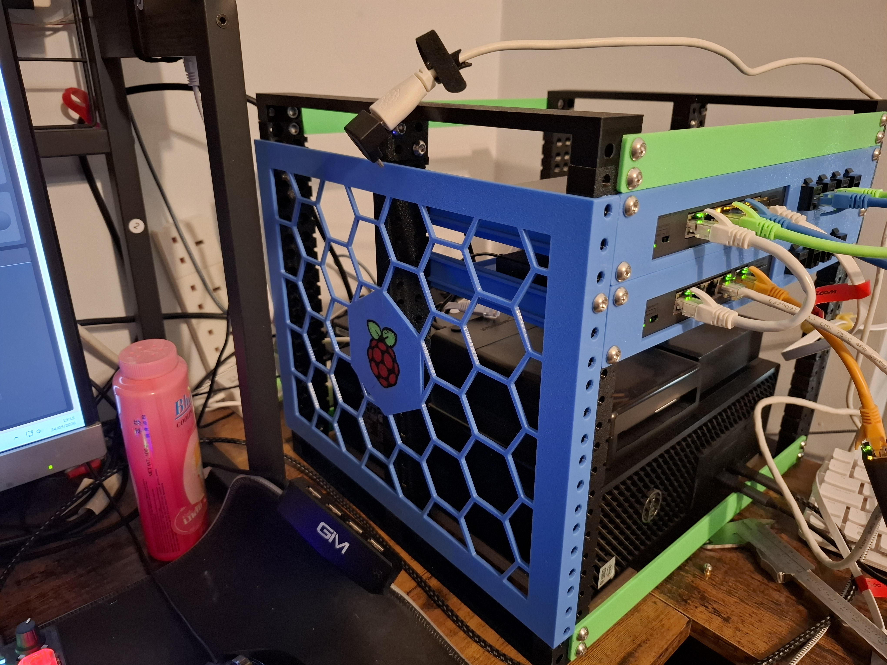

---

## Design Goals

- **Rear-slide tray support** — trays slide into a slot in the rear post rather than bolting front and rear. This means trays can be removed without dismantling the rack.
- **Fully parametric** — all dimensions, hole counts, heights and clearances are driven by variables. Use the OpenSCAD Customizer to configure parts without editing code.
- **Modular** — mix single/double-wide posts, variable-height trays and panels, and optional joiners.

---

## Parts

### Posts

Posts are the vertical rails of the rack. They are generated in configurable U heights and can be single or double wide. A slide channel can be added to the left side, right side, both sides, or neither. 
I highly recommend creating with top/bottom headers, double-wide, cones and side slides. 

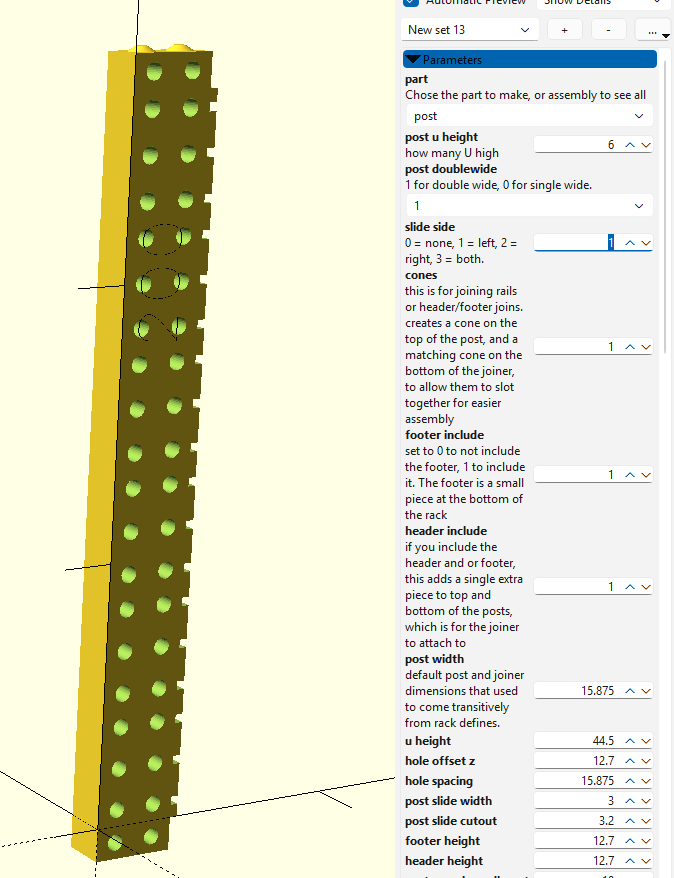

### Trays

Trays are available in fixed sizes (1U, 2U) or a fully variable size. The variable tray accepts a `tray_back_panel` flag to add a rear panel, turning it into a drawer. Trays slide into the post's rear slot for easy removal. Trays also don't need to be full length, defining 0.25 will make a quarter depth tray (y axis)

Look at "blank variable tray.scad" to find the tray code, but "intel dg45fg.scad" shows it being used.
More info on how to use later.

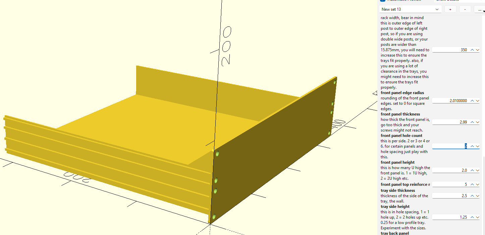

### Panels (Blanking Panels)

"rack panels.scad"

Flat front panels for blanking unused rack slots. Available in ½U, 1U, 2U.
Note that "blank variable tray" can now do all of this apart from the half-U. It is also the recommended method as you can customise it, reinforce, etc.

The half-U for joining posts together when using headers.

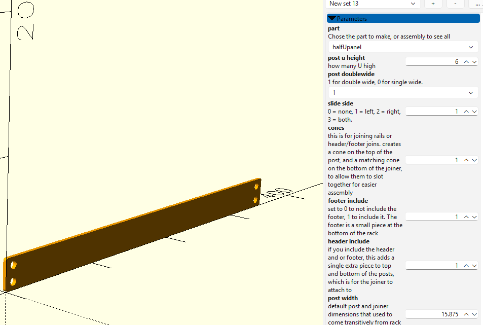

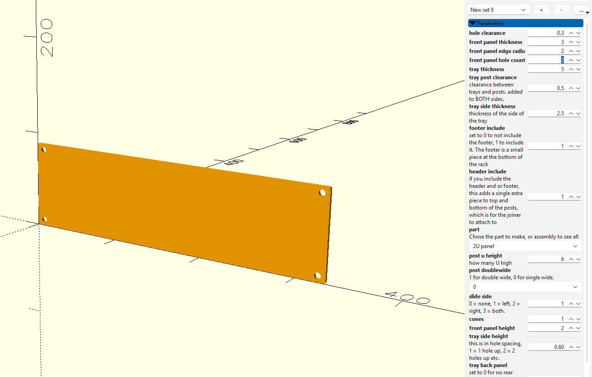

### Footer / Header

Optional pieces added to the top and bottom of POSTS. They provide an attachment point for the joiners.
If you want the front to rear support braces, I recommend adding these on.

### Joiners (Base / Top)

Optional horizontal joiners that connect the front posts to the rear posts via the footer/header. 
You can have more than just 4 posts. The joiners can have 2+ supports, by increasing the number and printing more posts, you can have greater supports

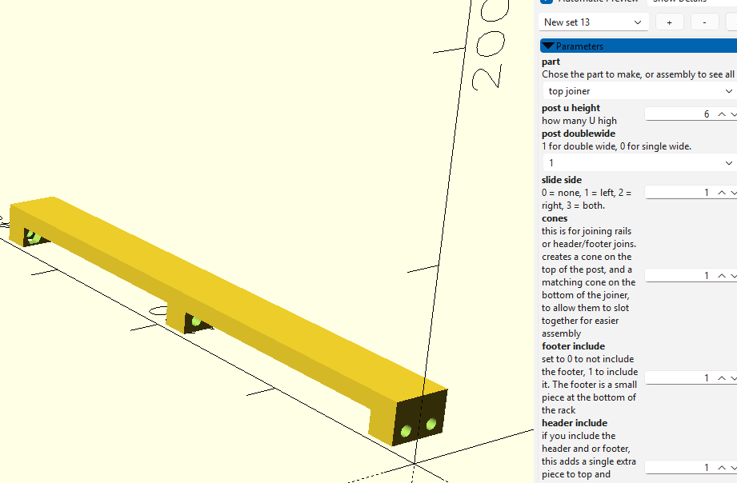

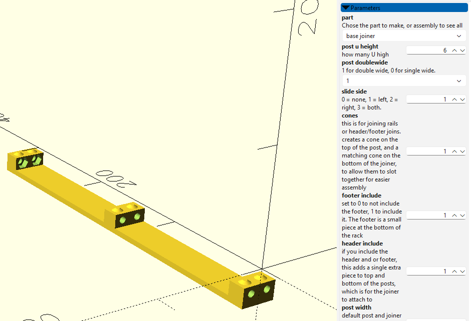

---

## Custom Trays

The file "intel dg45fg.scad" has a tray I've made for my mini-itx board. Yes it's an older board, this is because I want it for WinXP.
Anyway, it has:
- mount for a FlexATX PSU
- screw holes for mini-itx, for the back panel to be on the rear. (screw holes are sized for my heat-inserts)
- a LED hole in the front for hdd activity
- a Power button (large round) cutout
- Name of board/cpu inside on the front of the panel. (I use a engrave of 0.01mm, this makes it easy to 'paint' in my slicer, while still being level with the panel)
- reinforced front panel at the top
- reinforced rear, by creating a back panel, then chamfering it at 30deg. this is because I print panel face down and it means far less supports
- If my printer wasn't being a D. I'd have it printed by now. 

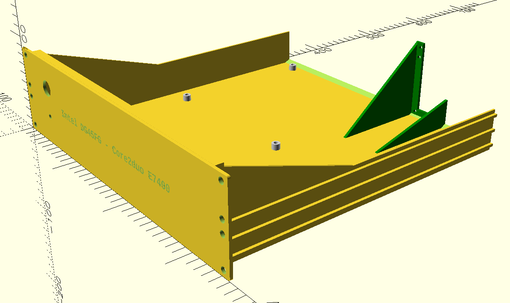

This picture is the mini-itx tray, but I chopped it to a tiny piece in the slicer, I highly recommend making test pieces before commiting to 12hour+ prints. Even create 1U post with sliders and a part tray to check clearances. Everyone's printer is different.

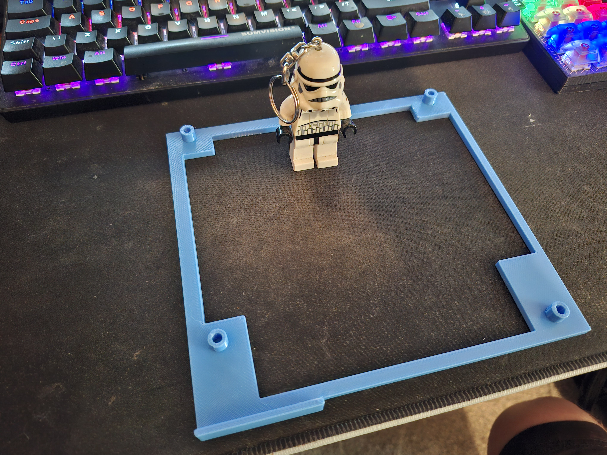

When I fix my printer I will print the mini-itx tray like the following picture, note that:
- I chop out parts to reduce filament usage.
- angle the cutouts so they don't require supports.
- print face down so the support rails don't require supports.
- print face down so my text on the front panel gets printed in one hit on a single layer, rather than changing filament many many times.
- created a back panel, but only small and use a chamfer. This is to create a reinforcement that doesn't require supports to print

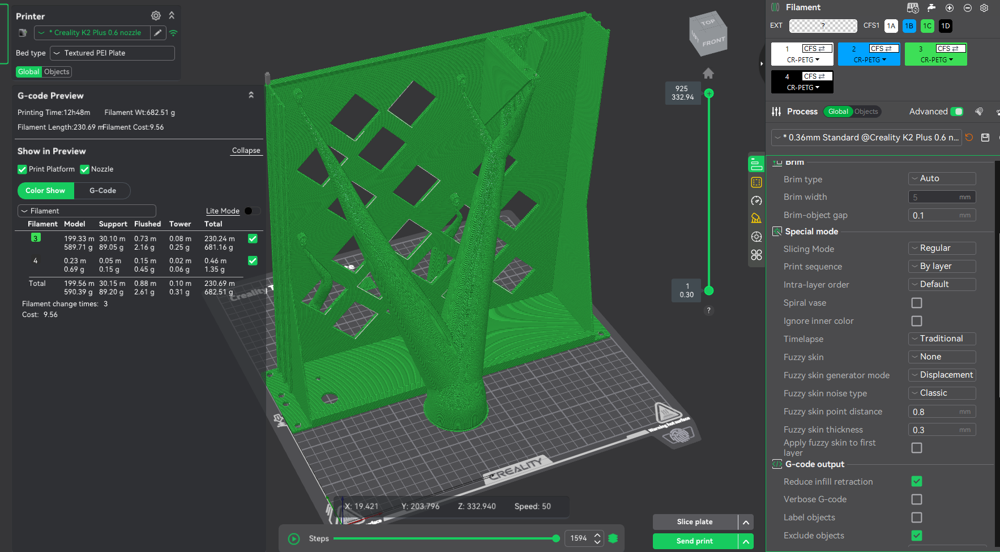

The file "ugreen um106x.scad" is another one I use, and have a photo of in use.
This was created to:
- have my 5 port switch
- 4x keystones

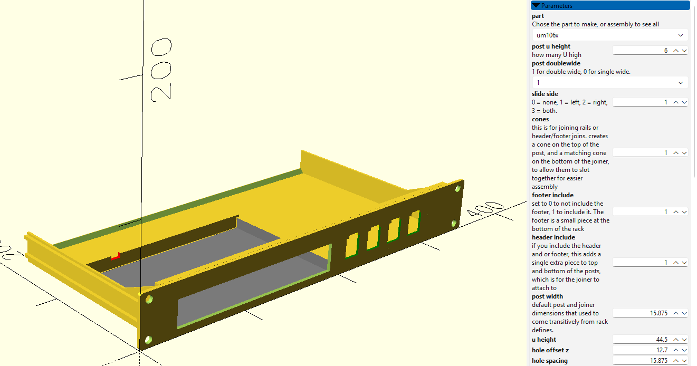

---

## Usage

1. Open `rack parts.scad` in OpenSCAD. This is not perfect. This will create the basic parts, but not highly customised trays.
2. Open the **Customizer** panel (Window → Customizer).
3. Select the part you want from the `part` dropdown:
   - `assembly` — preview all parts together
   - `post` — a single post, I recommend double-wide for future side panels etc, and slide_sides, if you want the trays to be supported.
   - `base joiner` / `top joiner` — horizontal joiners, also recommended. Make sure your posts have headers/footers and cones.
   - `1U tray` / `2U tray` / `variable tray` — trays
   - `halfUpanel` / `1U panel` / `2U panel` / `variable panel` — blanking panels
4. Adjust the parameters to suit your needs.
5. Render (F6) and export to STL or 3MF

### Key Parameters

| Parameter | Description |
|---|---|
| `post_u_height` | Height of the post in U units |
| `post_doublewide` | `0` = single wide, `1` = double wide |
| `slide_side` | `0` none, `1` left, `2` right, `3` both |
| `front_panel_height` | Panel/tray height in U (can be fractional, e.g. `1.5`) |
| `front_panel_hole_count` | Mounting holes per side (2, 3, 4, or 6) |
| `tray_side_height` | Tray side wall height in hole spacings |
| `tray_back_panel` | `0` = open tray, `1` = drawer with rear panel |
| `footer_include` / `header_include` | Include footer/header attachment pieces |

### Hardware

The design is based on **M6 screws** with **M6 hex nuts** (10mm across-flats, 5mm thick). Adjust `hole_clearance`, `hole_d`, `nut_diameter`, and `nut_thickness` if you want to use different fasteners.

---

## File Structure

| File | Purpose |
|---|---|
| `rack parts.scad` | Main entry point — select and configure parts here |
| `rack defines.scad` | All default dimensions and constants - DEPRECIATED, kept for reference|
| `rack posts.scad` | Post geometry |
| `rack panels.scad` | Panel geometry, for 0.5U, 1U and 2U |
| `intel dg45fg.scad` | My mini itx tray, useful for reference
| `blank variable tray.scad` | The main tray and panel making scad. Call blank_variable_tray() for everything, then customise.
---

The reason rack defines.scad is depreciated is because everything got refactored so that the default values of calling the functions are what was in the defines. Everything can be overriden in the function calls.
I really recommend having a look at the parts and how they are called, then look at the function/module they call, because I have commented all the options.

## Requirements

- [OpenSCAD](https://openscad.org/) the releases are ancient, use the nightlies instead. On raspberry pi you have to compile from source.
- A printer that can handle the size you want (e.g. Creality K2 Plus can do 350mm, Prusa XL can do 340mm)

---

## License

This project is licensed under the **Creative Commons - Attribution (CC BY)** for all the parts and **Creative Commons - Attribution - Non-Commercial (CC BY-NC)** for the specifications.

In simpler terms, you can remix and do whatever you want with making parts or modifying the parts, including selling. But the design spec, that is dimensions, guide slots on the posts, overall look, is the same terms but non-commercial use. This is specifically aimed at companies making racks using my design, not someone who makes some mods or addons and sells them. Even creating the whole thing as a print and selling is fine. Just not for manufacturers.

&copy; 2026 Adam Mead

## THIS PIC IS NOT MY DESIGN, but I did print it and this is what it produced. It is the reason I made my design:

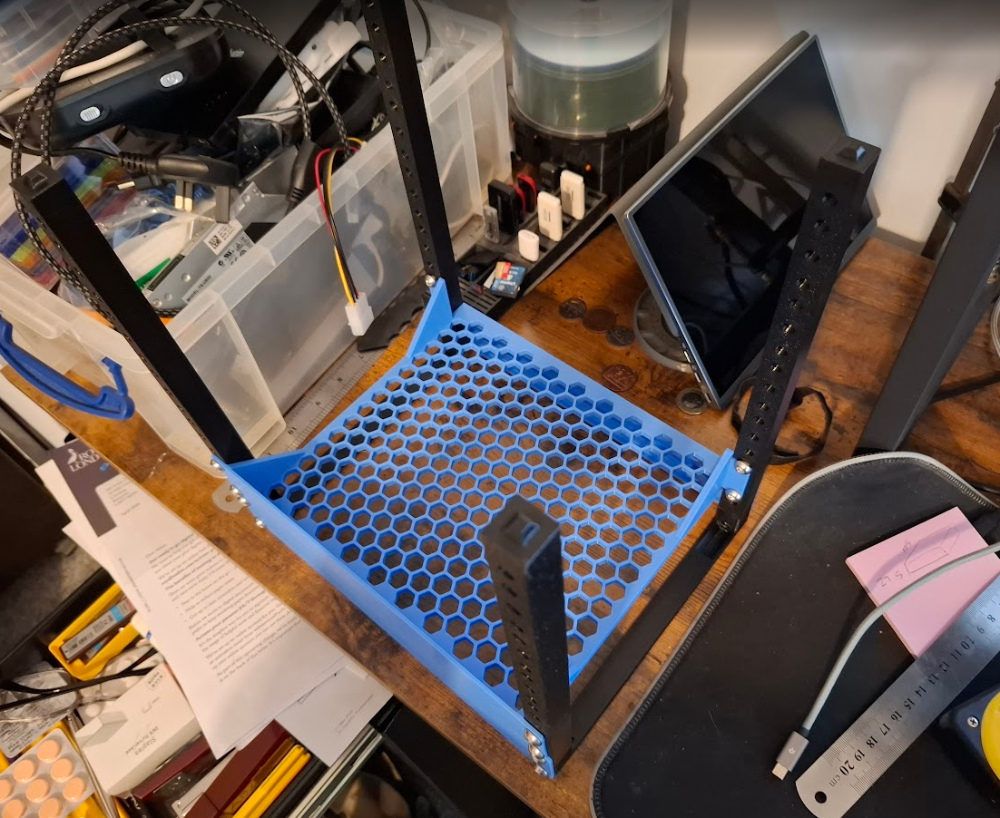

